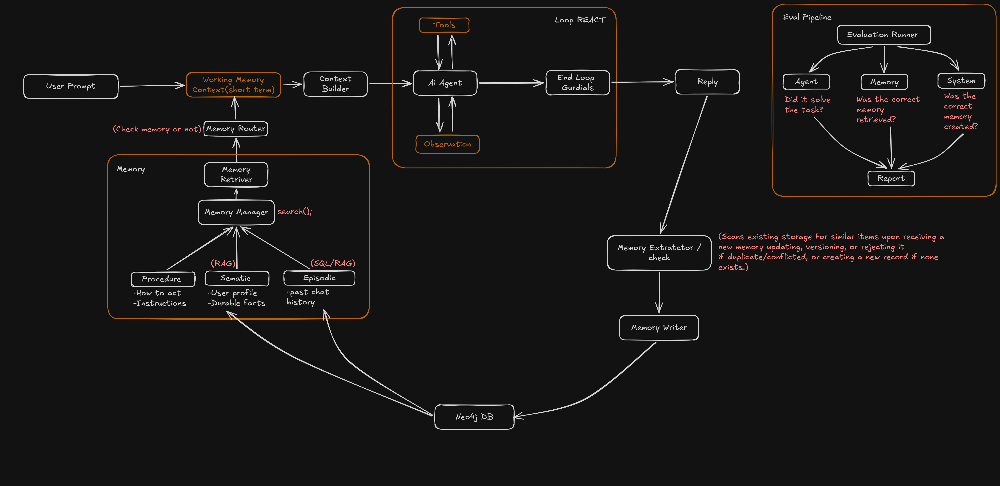

# AI Agent Memory Management System

A production-oriented memory management system for tool-using AI agents, built with **LangGraph** and **Neo4j**.

The system is designed to solve the problem of stateless LLM applications by giving an agent access to structured long-term memory while keeping the current task context separate from persistent memory.

It combines three types of memory:

- **Semantic Memory** — stable user facts, preferences, and knowledge.
- **Episodic Memory** — past interactions, events, and experiences.
- **Procedural Memory** — reusable procedures and task-specific knowledge.

The agent uses a **ReAct-style decision loop** to decide when it needs tools or memory. Relevant memories are retrieved, scored, and added to the agent's working context rather than blindly passing the entire conversation history.

After a task is completed, the system extracts potential memories, validates them, checks for existing similar or conflicting memories, and then creates or updates persistent memory in **Neo4j**.

## Architecture



## Core Flow

```text
User
  ↓
Working Memory
  ↓
Context Builder
  ↓
AI Agent
  ↕
Tools / Memory
  ↕
Observation
  ↓
Final Answer
  ↓
Memory Extraction
  ↓
Validation / Conflict Check
  ↓
Memory Writer
  ↓
Neo4j
```

The goal is not simply to make an agent "remember more", but to **retrieve the right memory at the right time** and provide the agent with relevant context while maintaining a manageable and persistent memory layer.
